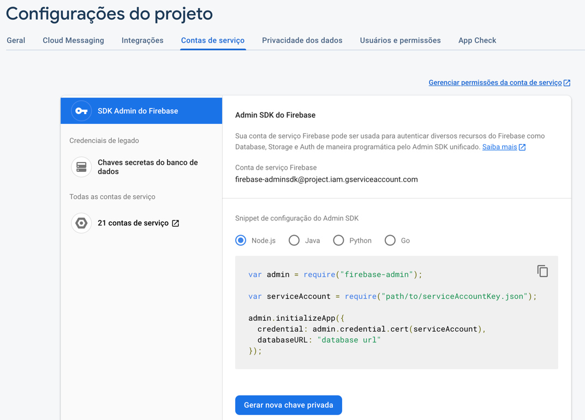
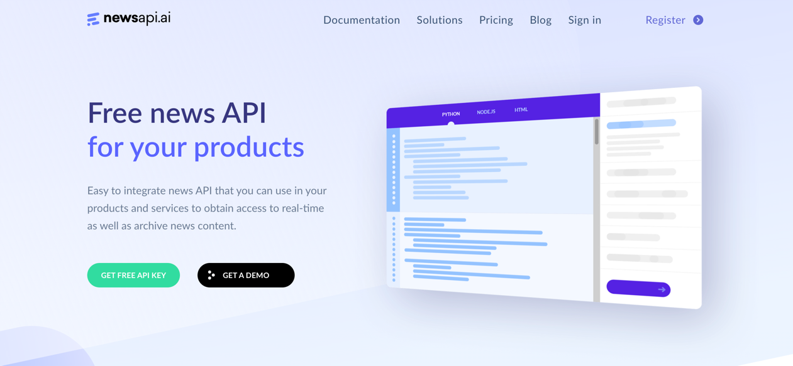

### Script de atualização de um banco de dados de notícias

### Como está organizado a estrutura de diretórios

Os diretórios estão organizados de forma bastante simples, sem apego a um 'design patterns' ou quais outras definições formais do desenvolvimento de softwares.

```text
|—— src/
|  |—— config/
|  |  └── firebase-config.js
|  |—— core/
|  |  └── news-io-core.js 
|  |—— repository/
|  |  └── general-repository.js
|  |—— service/
|  |  └── news-io-service.js
|  |—— triggers/
|  |  └── news-trigger.js
|  |—— utils/
|  |  └── cron.js
|  └── index.js
|—— .env
|—— ecosystem.config.js
|—— package.json
└── service-account-key.json
```

### Setup do Projeto

Antes de executar o projeto é necessário configurar o Firebase e criar uma conta na api de notícias.....

#### Configurar o Firebase e Firestore;
- Criação de um projeto no firebase, comece por aqui https://firebase.google.com/?hl=pt;
- Criação de uma instância do firestore, procure por 'firestore' no menu lateral, clique e siga as instruções, saiba mais em https://firebase.google.com/docs/firestore;
- Baixe a chave de acesso para Admin SDK, vá em configurações -> contas de serviço -> SDK Admin do Firebase -> Clique em Gerar Nova Chave Privada;
  - Na aba vai conter um snnipet de configuração semelhante ao src/core/firebase.config.js;
  - Copie a url do banco de dados no snnipet e cole no arquivo de configuração do projeto;
  - Salve a chave gerada na raiz do projeto em `service-account-key.json`;



#### Configurar a API de Notícias
- Crie uma conta na API de notícias e pegue a chave da API https://newsapi.ai/;
- adicione a variável `NEWS_APITOKEN_IO=chave_da_api_de_noticias` no arquivo .env;



#### Instalar dependências
```shell
npm i
```

#### Executar o projeto
```shell
npm start
```

#### Como deixar o projeto rodando em segundo plano
Instale o PM2
```shell
npm i -g pm2
```

Execute o projeto rodando esse comando na raiz do projeto
```shell
pm2 start ecosystem.config.js
```